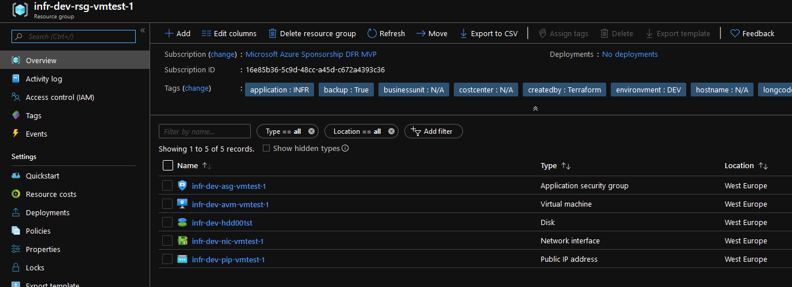

# Azure Hub VM Setup

## This config deploys an Azure VM in the Hub Vnet

The VM is deployed in its own resource group for ease of RBAC Management later

### 1. List of Azure resources deployed with this terraform configuration

|Resources type | Resources usage | Info | naming convention |
|---------------|:---------------:|:----:|------------------:|
|Resource Group | Group VM resources | N/A | longcode-environment-rsg-role-index |
|Application Security Group | ASG for the VM Hub | located in the Resource Group for the VM | longcode-environment-asg-role-index |
|Public IP | Public IP for the VM | Located in the Resource Group for the VM | N/A |longcode-environment-pip-role-index |
|Network Interface Card | NIC for the VM Hub | Located in the Resource Group for the VM| N/A | longcode-environment-pip-role-index |
|NIC - ASG Association | Associate the NIC to its ASG | Still not fully supported for the current provider, may require to use the application_security_group_ids param in the NIC also | N/A |
|Azure VM | VM deployed in the Bastion Subnet | Located in the Resource Group the VM | longcode-environment-avm-role-index |
|BGInfo VM Extension | Agent deploying the BGInfo utility on the VM | Located in the Resource Group for the VM | N/A |
|NSG Rule | Allow RDP from Internet on the VM | Ladded on the NSG associated to the subne tin which the VM lives | N/A |

Note: 

### 2. Terraform provider configuration

The terraform provider is configured in the file **"00 Azure Authentication.tf"**

```hcl.js

provider "azurerm" {
  subscription_id = var.AzureSubscriptionID
  client_id       = var.AzureClientID
  client_secret   = var.AzureClientSecret
  tenant_id       = var.AzureTenantID
}

```

Variable for the provider should be written in a secret file in case of a deployment in a pipeline.

For a simple deployment, use the authentication through az cli and comment the tf file

```hcl.js

provider "azurerm" {
  /*subscription_id = var.AzureSubscriptionID
  client_id       = var.AzureClientID
  client_secret   = var.AzureClientSecret
  tenant_id       = var.AzureTenantID*/
}

```

Specify the azure storage account used as a backend, which should have been created with the script configurebackend.ps1, with variables value for the authentication in a file to be stored as secret in Azure Devops:
:

```hcl.js

terraform {
  backend "azurerm" {
    storage_account_name = "The name of the storage account"
    container_name       = "the name of the container"
    key                  = "name of the blob to store the backend"
    access_key           = "storageaccountaccesskey"
  }
}

variable "AzureSubscriptionID" {
  type    = "string"
  default = "xxxxxxxx-xxxx-xxxx-xxxx-xxxxxxxxxxx"
}

variable "AzureClientID" {
  type    = "string"
  default = "xxxxxxxx-xxxx-xxxx-xxxx-xxxxxxxxxxxf"
}


variable "AzureClientSecret" {
  type    = "string"
  default = ""

}

variable "AzureTenantID" {
  type    = "string"
  default = "xxxxxxxx-xxxx-xxxx-xxxx-xxxxxxxxxxx"
}

```


Login to azure, list the available subscription and select the one targeted for the deployment:

```powershell.js

az login -u <userlogin>
az account list --output table
az account set --subscription xxxxxxxx-xxxx-xxxx-xxxx-xxxxxxxxxxx

```

### 3. Terraform configuration deployment


This configuration uses Data source, more accurately, it uses a terraform backend as a data source.
For the Diagnostic logs to be stored in the appropriate storage account, is is simpler and more elegant to use the terraform backend instead of refering the storage account manually in the code. Thus the need of data source. The following display the data source file : 


```hcl.js

######################################################################
# Data source for underlying infrastructure
######################################################################

data "azurerm_subscription" "current" {}

#Data source for remote state hub

data "terraform_remote_state" "HubState" {
  backend   = "azurerm"
  config = {
    storage_account_name = var.statestoa
    container_name       = var.statecontainer
    key                  = var.statekey
    access_key           = var.statestoakey
  }
}


#Data source for remote state KeyVault


data "terraform_remote_state" "KeyVaultState" {
  backend   = "azurerm"
  config = {
    storage_account_name = var.statestoa
    container_name       = var.statecontainer
    key                  = var.statekeykeyvault
    access_key           = var.statestoakey
  }
}

#Data source for RG containing the Vnet Hub

data "azurerm_resource_group" "RGHub" {
  name = data.terraform_remote_state.HubState.outputs.RGHubName
}


#Data source for the Vnet Hub


data "azurerm_virtual_network" "VNetHub" {
  name                = data.terraform_remote_state.HubState.outputs.VNetHubName
  resource_group_name = data.azurerm_resource_group.RGHub.name
}


#Data source for the Bastion subnet

data "azurerm_subnet" "BastionSubnet" {
  name                    = data.terraform_remote_state.HubState.outputs.SubnetHubBastionName
  resource_group_name     = data.azurerm_resource_group.RGHub.name
  virtual_network_name    = data.azurerm_virtual_network.VNetHub.name
}

data "azurerm_subnet" "SharedSVCSubnet" {
  name                    = data.terraform_remote_state.HubState.outputs.SubnetHubSharedSVCName
  resource_group_name     = data.azurerm_resource_group.RGHub.name
  virtual_network_name    = data.azurerm_virtual_network.VNetHub.name
}


#Data source for the Bastion NSG

data "azurerm_network_security_group" "BastionNSG" {
  name                    = data.terraform_remote_state.HubState.outputs.HUbNSGBastionName
  resource_group_name     = data.azurerm_resource_group.RGHub.name

}

#Data source for the SharedSVC NSG

data "azurerm_network_security_group" "SharedSVCNSG" {
  name                    = data.terraform_remote_state.HubState.outputs.HUbNSGShareSVCName
  resource_group_name     = data.azurerm_resource_group.RGHub.name

}


data "azurerm_resource_group" "KeyVaultRG" {
  name = data.terraform_remote_state.KeyVaultState.outputs.RGKeyVaultName
}

data "azurerm_key_vault" "Keyvault" {
  name                = data.terraform_remote_state.KeyVaultState.outputs.KeyVaultName
  resource_group_name = data.azurerm_resource_group.KeyVaultRG.name
}

data "azurerm_key_vault_secret" "VMPassword" {
    name                        = "WinVMPassword"
    key_vault_id                = data.azurerm_key_vault.Keyvault.id
}


```

We reference 2 remote state as data source: 
- The Hub state
- The KeyVault State


The second part of the config uses the classic azurerm provider data source, with references to the terraform backend fo the resource name. Thus, the data source are updated dynamically with the terraform config referenced as data source.


Fill in the terraform.tfvars to input the value of the variable

```hcl.js

######################################################################
# This file configure the values of the config variables
######################################################################
#The Azure region targetted by the provider
AzureRegion           = "" 
#A short string to designate the RG usage
#The name of the resource is build with concatnation of variable in the module
RGRole             = "" 
#Same but for the VNet Usage
VNetRole           = "" 
#The VNet Address space, taken with agreement of the Network Team
VNetHubAddressSpace   = ["xxx.xxx.xxx.xxx/yy"]
#A list of name to add at the end of the name of the subnets
HubSubnetName         = [
  "SharedSVC-1",
  "Bastion-1"
]
#The range of the infra subnets, taken in the VNet Range
#The Infra Subnet designate the Subnet mandatory for the configuration
#Those subnets are the AzureFirewallSubnet and the GatewaySubnet
#Those ranges should be for the GatewaySubnet a /27, and for the AzureFirewallSubnet a /26
SubnetInfraaddressprefix = [
    "xxx.xxx.xxx.xxx/yy",
    "xxx.xxx.xxx.xxx/yy"
  ]
#The range of the hub subnets, taken in the VNet Range
SubnetHubaddressprefix = [
    "xxx.xxx.xxx.xxx/yy",
    "xxx.xxx.xxx.xxx/yy"
  ]

#A short string to designate the Public IP usage, this public IP is for the Azure Firewall
FWPublicIProle      = "hub-1"
#A short string to disgnate the Azure Firewall
FWrole              = "hub-1"

  #Tags related resources
  applicationTag       = "infr"
  longcodeTag          = "infr"
  costcenterTag        = "N/A"
  businessunitTag      = "N/A"
  managedbyTag         = "N/A"
  environmentTag       = "dev"
  hostnameTag          = "N/A"
  ownerTag             = "dfr"
  roleTag              = "hub"
  createdbyTag         = "terraform"
  backupTag            = "false"

```

## Display after provisioning

You should have the following display in the Azure portal at the end of the deployment




